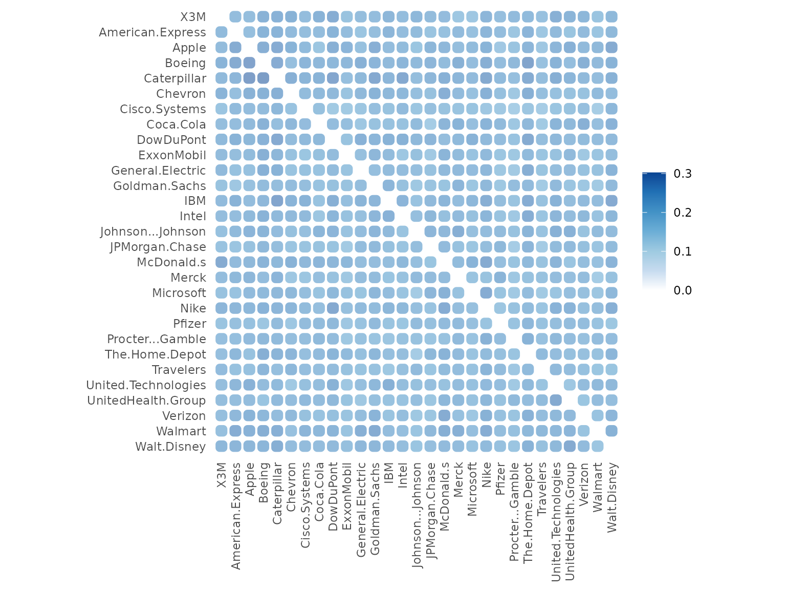
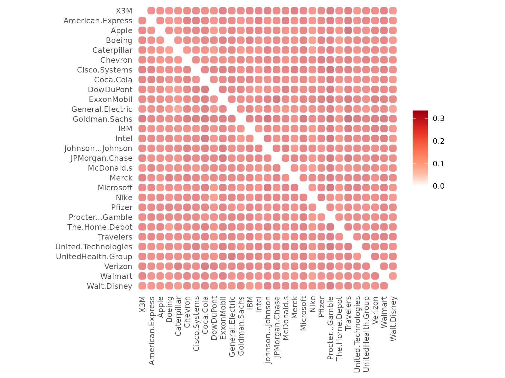
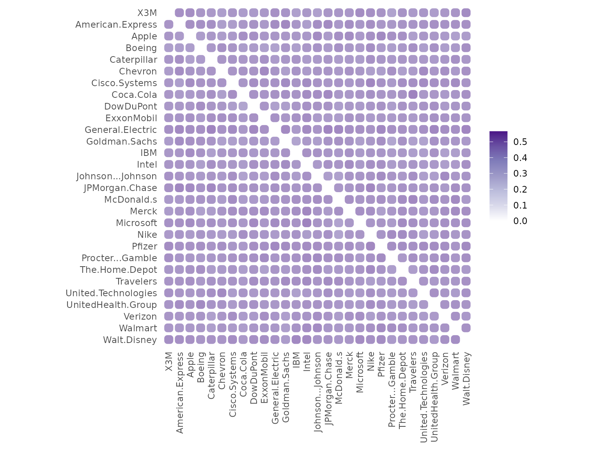
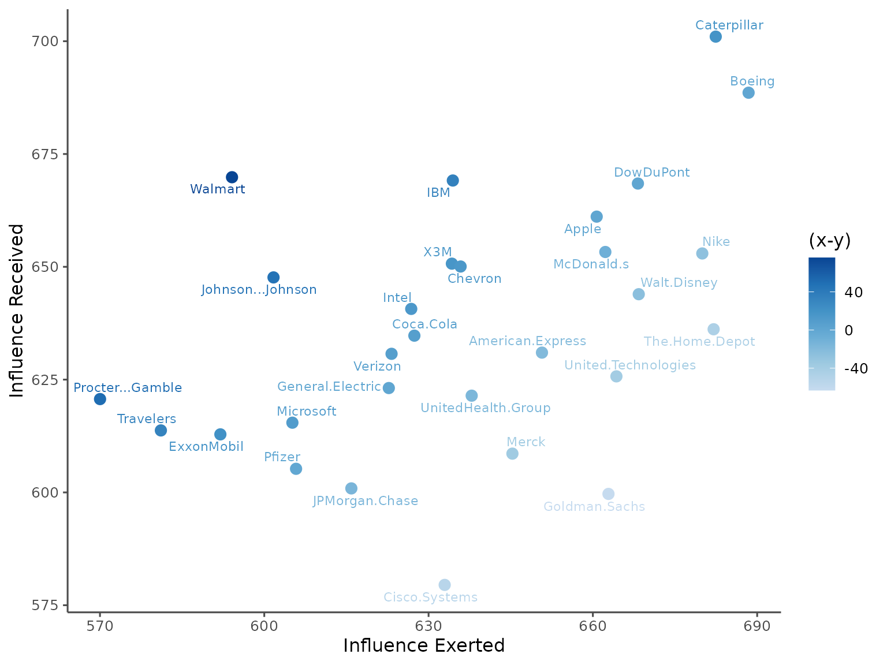
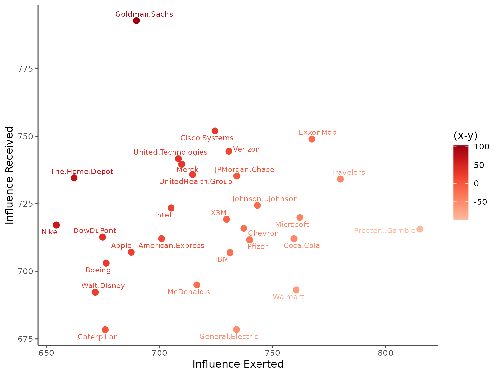
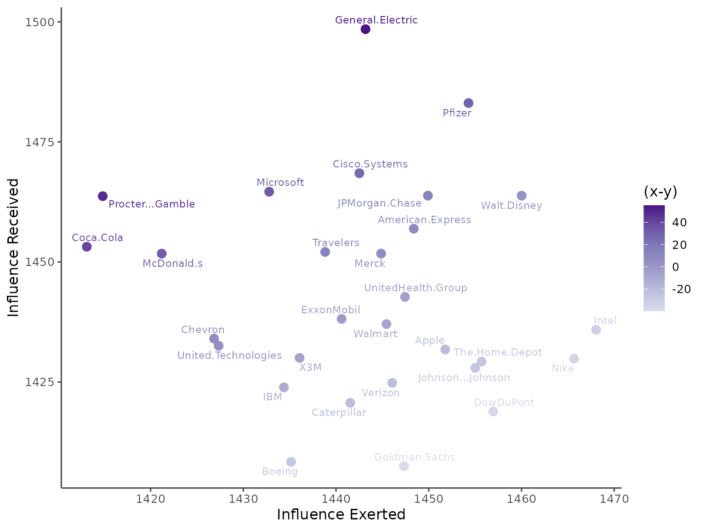
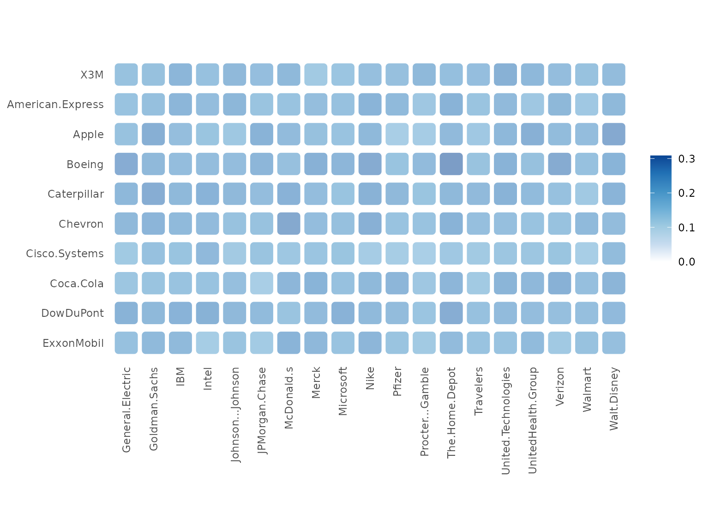

# Multiple Series Pattern Causality Analysis: Unveiling System-Wide Interactions

This vignette provides a comprehensive demonstration of multivariate
pattern causality analysis, a powerful technique for investigating
complex interactions within large-scale systems. This approach is
particularly useful when dealing with multiple interconnected time
series, allowing us to move beyond pairwise analysis and understand
system-wide dynamics. The key aspects of this analysis include:

1.  **Matrix-based causality assessment:** Quantifying causal
    relationships between all pairs of time series in the system,
    represented in a matrix format.
2.  **System-wide pattern identification:** Identifying recurring
    patterns of behavior across the entire system, revealing underlying
    dynamics.
3.  **Visualization of complex causal relationships:** Using graphical
    representations to make intricate causal networks more
    understandable.
4.  **Analysis of effects across the entire system:** Measuring the
    overall impact of causality within the system, providing insights
    into the collective behavior.

The matrix-based approach is particularly well-suited for the study of:

- **Financial market networks:** Analyzing the interconnectedness of
  stock prices and other financial instruments.
- **Economic systems:** Understanding the relationships between various
  economic indicators and their impact on the overall economy.
- **Social networks:** Investigating the spread of information and
  influence within social structures.
- **Complex ecological systems:** Studying the interactions between
  different species and environmental factors.

## Pattern Causality Matrix

In this vignette, we will utilize the DJS dataset, which comprises 29
stock price series. This dataset provides a sufficiently large and
complex system to demonstrate the capabilities of our multivariate
pattern causality analysis.

``` r
library(patterncausality)
data(DJS)
#head(DJS)
```

Before estimating the causality matrix, it is crucial to determine the
optimal parameters for our analysis. These parameters, including the
embedding dimension (`E`) and time delay (`tau`), significantly
influence the accuracy and reliability of the results. We use the
`optimalParametersSearch` function to identify these optimal values:

``` r
dataset <- DJS[,-1] # remove the date column
params <- optimalParametersSearch(
  Emax = 3, 
  tauMax = 3, 
  metric = "euclidean", 
  dataset = dataset,
  verbose = FALSE
)
print(params)
```

With the optimal parameters identified, we can now estimate the pattern
causality matrix using the `pcMatrix` function. This function calculates
the causality between all pairs of time series in the dataset, resulting
in a matrix representation of the system’s causal structure.

``` r
result <- pcMatrix(
  dataset = dataset, 
  E = 3,           # Embedding dimension
  tau = 1,         # Time delay
  metric = "euclidean",
  h = 1,           # Prediction horizon
  weighted = FALSE  # Unweighted analysis
)
```

The resulting analysis yields three matrices, each representing a
different aspect of causality: positive, negative, and dark causality.
These matrices can be accessed through the `pc_matrix` object.

``` r
print(result)
#> Pattern Causality Matrix Analysis:
#> 
#> Number of items: 29 
#> 
#> Positive causality matrix:
#>                        X3M American.Express     Apple    Boeing
#> X3M                     NA        0.2261268 0.2224979 0.2565688
#> American.Express 0.2318415               NA 0.2198748 0.2522231
#> Apple            0.2283262        0.2680412        NA 0.2622407
#> Boeing           0.2507485        0.2711864 0.2869058        NA
#> Caterpillar      0.2330168        0.2438080 0.2966432 0.3024545
#>                  Caterpillar
#> X3M                0.2549020
#> American.Express   0.2511664
#> Apple              0.2674617
#> Boeing             0.2675737
#> Caterpillar               NA
#> ...
#> 
#> Negative causality matrix:
#>                        X3M American.Express     Apple    Boeing
#> X3M                     NA        0.2421696 0.2406948 0.2295209
#> American.Express 0.2523844               NA 0.2480438 0.2174616
#> Apple            0.2592275        0.2353952        NA 0.2456432
#> Boeing           0.2649701        0.2397094 0.2243536        NA
#> Caterpillar      0.2556611        0.2291022 0.2209212 0.2019002
#>                  Caterpillar
#> X3M                0.2405732
#> American.Express   0.2192846
#> Apple              0.2248722
#> Boeing             0.2290249
#> Caterpillar               NA
#> ...
#> 
#> Dark causality matrix:
#>                        X3M American.Express     Apple    Boeing
#> X3M                     NA        0.5317036 0.5368073 0.5139104
#> American.Express 0.5157740               NA 0.5320814 0.5303153
#> Apple            0.5124464        0.4965636        NA 0.4921162
#> Boeing           0.4842814        0.4891041 0.4887406        NA
#> Caterpillar      0.5113221        0.5270898 0.4824356 0.4956453
#>                  Caterpillar
#> X3M                0.5045249
#> American.Express   0.5295490
#> Apple              0.5076661
#> Boeing             0.5034014
#> Caterpillar               NA
#> ...
```

The `plot` function for object `pc_matrix` provides a powerful tool for
visualizing these complex matrices. By plotting each causality type
separately, we can gain a deeper understanding of the system’s dynamics.

- Positive causality status

``` r
plot(result, "positive")
```



- Negative causality status

``` r
plot(result, "negative")
```



- Dark causality status

``` r
plot(result, "dark")
```



The visualization reveals a clear positive connection within the system,
indicating a tendency for stocks to influence each other positively.

## Pattern Causality Effect

Following the matrix calculation, we can quantify the total effect
within the system using the `pcEffect` function. This function
aggregates the causality measures to provide a system-wide perspective
on the overall impact of pattern causality.

``` r
effects <- pcEffect(result)
print(effects)
#> Pattern Causality Effect Analysis
#> --------------------------------
#> 
#> Positive Causality Effects:
#>                     received exerted   Diff
#> X3M                   650.70  634.25  16.45
#> American.Express      630.98  650.71 -19.72
#> Apple                 661.12  660.70   0.42
#> Boeing                688.59  688.43   0.15
#> Caterpillar           701.02  682.44  18.58
#> Chevron               650.07  635.85  14.22
#> Cisco.Systems         579.50  632.94 -53.44
#> Coca.Cola             634.74  627.41   7.34
#> DowDuPont             668.46  668.23   0.23
#> ExxonMobil            612.87  591.98  20.88
#> General.Electric      623.13  622.74   0.39
#> Goldman.Sachs         599.67  662.85 -63.18
#> IBM                   669.13  634.43  34.70
#> Intel                 640.67  626.83  13.84
#> Johnson...Johnson     647.65  601.69  45.96
#> JPMorgan.Chase        600.89  615.90 -15.01
#> McDonald.s            653.29  662.28  -8.99
#> Merck                 608.59  645.31 -36.72
#> Microsoft             615.45  605.13  10.32
#> Nike                  652.96  679.98 -27.02
#> Pfizer                605.23  605.80  -0.57
#> Procter...Gamble      620.69  570.01  50.67
#> The.Home.Depot        636.16  682.05 -45.89
#> Travelers             613.74  581.12  32.62
#> United.Technologies   625.72  664.30 -38.58
#> UnitedHealth.Group    621.44  637.87 -16.43
#> Verizon               630.72  623.24   7.48
#> Walmart               669.86  594.11  75.75
#> Walt.Disney           643.93  668.38 -24.45
#> 
#> Negative Causality Effects:
#>                     received exerted   Diff
#> X3M                   719.26  729.68 -10.41
#> American.Express      712.08  700.91  11.17
#> Apple                 707.09  687.52  19.57
#> Boeing                703.02  676.41  26.60
#> Caterpillar           678.31  676.03   2.28
#> Chevron               715.89  737.31 -21.42
#> Cisco.Systems         752.02  724.54  27.48
#> Coca.Cola             712.08  759.47 -47.40
#> DowDuPont             712.68  674.83  37.85
#> ExxonMobil            748.99  767.41 -18.42
#> General.Electric      678.39  734.08 -55.69
#> Goldman.Sachs         792.84  689.82 103.02
#> IBM                   706.97  731.20 -24.23
#> Intel                 723.44  705.11  18.33
#> Johnson...Johnson     724.40  743.30 -18.90
#> JPMorgan.Chase        735.29  734.19   1.10
#> McDonald.s            694.97  716.52 -21.56
#> Merck                 739.65  709.82  29.83
#> Microsoft             719.92  762.08 -42.16
#> Nike                  717.16  654.36  62.80
#> Pfizer                711.68  739.91 -28.23
#> Procter...Gamble      715.60  815.15 -99.54
#> The.Home.Depot        734.57  662.25  72.32
#> Travelers             734.16  780.05 -45.89
#> United.Technologies   741.72  708.36  33.35
#> UnitedHealth.Group    735.82  714.69  21.13
#> Verizon               744.45  730.70  13.74
#> Walmart               693.07  760.45 -67.38
#> Walt.Disney           692.26  671.61  20.65
#> 
#> Dark Causality Effects:
#>                     received exerted   Diff
#> X3M                  1430.04 1436.07  -6.03
#> American.Express     1456.93 1448.38   8.55
#> Apple                1431.79 1451.78 -19.99
#> Boeing               1408.40 1435.15 -26.75
#> Caterpillar          1420.67 1441.54 -20.87
#> Chevron              1434.04 1426.84   7.20
#> Cisco.Systems        1468.48 1442.52  25.97
#> Coca.Cola            1453.18 1413.12  40.06
#> DowDuPont            1418.86 1456.95 -38.08
#> ExxonMobil           1438.15 1440.61  -2.46
#> General.Electric     1498.48 1443.18  55.30
#> Goldman.Sachs        1407.49 1447.33 -39.84
#> IBM                  1423.91 1434.37 -10.47
#> Intel                1435.88 1468.06 -32.17
#> Johnson...Johnson    1427.95 1455.01 -27.06
#> JPMorgan.Chase       1463.82 1449.91  13.91
#> McDonald.s           1451.75 1421.20  30.55
#> Merck                1451.75 1444.87   6.89
#> Microsoft            1464.63 1432.79  31.84
#> Nike                 1429.88 1465.66 -35.78
#> Pfizer               1483.09 1454.29  28.80
#> Procter...Gamble     1463.71 1414.84  48.87
#> The.Home.Depot       1429.27 1455.70 -26.43
#> Travelers            1452.10 1438.83  13.27
#> United.Technologies  1432.56 1427.34   5.22
#> UnitedHealth.Group   1442.74 1447.44  -4.70
#> Verizon              1424.83 1446.06 -21.22
#> Walmart              1437.07 1445.44  -8.37
#> Walt.Disney          1463.81 1460.01   3.80
```

The total effect of pattern causality can be observed, providing a
measure of the overall strength of causal interactions within the
system.

- Positive causality status

``` r
plot(effects, status="positive")
```



- Negative causality status

``` r
plot(effects, status="negative")
```



- Dark causality status

``` r
plot(effects, status="dark")
```



## Cross Matrix analysis

Sometimes, we also need to face the problem that X has multiple series,
and Y also has multiple series, we want to know the causality between
each series in X and each series in Y, to save the computation time, we
can use the `pcCrossMatrix` function to get the causality matrix from
each series in X to Y.

This time we construct the datasets for X and Y in stock dataset.

``` r
dataset <- DJS[, -1]

X <- dataset[, 1:10]
Y <- dataset[, 11:29]
```

Then we can estimate the causality matrix from each series in X to Y and
give the new matrix from X to Y.

``` r
result_cross <- pcCrossMatrix(
  X = X,
  Y = Y,
  E = 3,
  tau = 1,
  metric = "euclidean",
  h = 1,
  weighted = FALSE,
  verbose = FALSE
)
```

The new matrix will be saved in the `result_cross` object, we can also
plot the matrix by the `plot` function.

``` r
plot(result_cross, "positive")
```



This will show the causality matrix from each series in X to Y and the
color of the matrix represents the causality strength in the whole
period.

We provide the multiple types of multi-series pattern causality analysis
here and it would be useful to face many different situatiuons for the
matrix analysis and network analysis.
