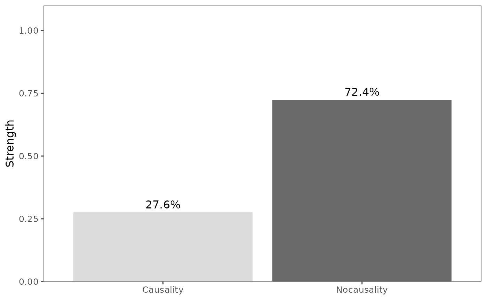
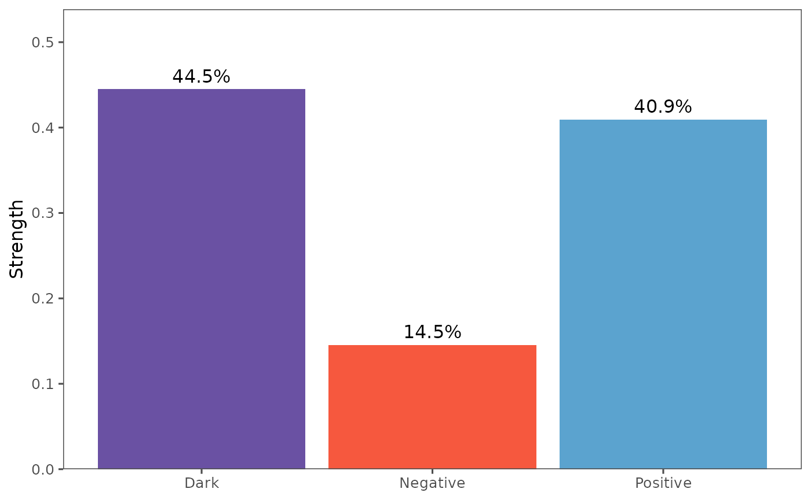

# Exploring Pattern Causality: An Intuitive Guide

**Pattern Causality** is a novel approach for detecting and analyzing
causal relationships within complex systems. It is particularly
effective at:

1.  **Identifying hidden patterns in time series data:** Uncovering
    underlying regularities in seemingly random data.
2.  **Quantifying different types of causality:** Distinguishing between
    positive, negative, and “dark” causal influences, which are often
    difficult to observe directly.
3.  **Providing robust statistical analysis:** Ensuring the reliability
    of causal inferences through rigorous statistical methods.

This algorithm is especially useful in the following domains:

- **Financial market analysis:** Understanding the interdependencies
  between different assets.
- **Climate system interactions:** Revealing the complex relationships
  between various factors in climate change.
- **Medical diagnosis:** Assisting in the analysis of disease
  progression patterns to identify potential causes.
- **Complex system dynamics:** Studying the interactions between
  components in various complex systems.

## Application in Financial Markets

First, we import stock data for Apple (AAPL) and Microsoft (MSFT). You
can also import data using the **yahooo** API.

``` r
library(patterncausality)
data(DJS)
head(DJS)
#>         Date     X3M American.Express    Apple  Boeing Caterpillar
#> 1 2000-01-03 47.1875         45.88031 3.997768 40.1875    24.31250
#> 2 2000-01-04 45.3125         44.14794 3.660714 40.1250    24.00000
#> 3 2000-01-05 46.6250         42.96264 3.714286 42.6250    24.56250
#> 4 2000-01-06 50.3750         43.83794 3.392857 43.0625    25.81250
#> 5 2000-01-07 51.3750         44.47618 3.553571 44.3125    26.65625
#> 6 2000-01-10 51.1250         45.09618 3.491071 43.6875    25.78125
#>    Chevron Cisco.Systems Coca.Cola DowDuPont ExxonMobil
#> 1 41.81250      54.03125  28.18750  44.20833   39.15625
#> 2 41.81250      51.00000  28.21875  43.00000   38.40625
#> 3 42.56250      50.84375  28.46875  44.39583   40.50000
#> 4 44.37500      50.00000  28.50000  45.64583   42.59375
#> 5 45.15625      52.93750  30.37500  46.66667   42.46875
#> 6 43.93750      54.90625  29.40625  45.47917   41.87500
#>   General.Electric Goldman.Sachs      IBM    Intel Johnson...Johnson
#> 1         50.00000       88.3125 116.0000 43.50000          46.09375
#> 2         48.00000       82.7500 112.0625 41.46875          44.40625
#> 3         47.91667       78.8750 116.0000 41.81250          44.87500
#> 4         48.55727       82.2500 114.0000 39.37500          46.28125
#> 5         50.43750       82.5625 113.5000 41.00000          48.25000
#> 6         50.41667       84.3750 118.0000 42.87500          47.03125
#>   JPMorgan.Chase McDonald.s   Merck Microsoft     Nike  Pfizer
#> 1       48.58333    39.6250 67.6250  58.28125 6.015625 31.8750
#> 2       47.25000    38.8125 65.2500  56.31250 5.687500 30.6875
#> 3       46.95833    39.4375 67.8125  56.90625 6.015625 31.1875
#> 4       47.62500    38.8750 68.3750  55.00000 5.984375 32.3125
#> 5       48.50000    39.8750 74.9375  55.71875 5.984375 34.5000
#> 6       47.66667    40.0625 72.7500  56.12500 6.085938 34.4375
#>   Procter...Gamble The.Home.Depot Travelers United.Technologies
#> 1         53.59375        65.1875   33.0000            31.25000
#> 2         52.56250        61.7500   32.5625            29.96875
#> 3         51.56250        63.0000   32.3125            29.37500
#> 4         53.93750        60.0000   32.9375            30.78125
#> 5         58.25000        63.5000   34.2500            32.00000
#> 6         57.96875        63.1875   33.6250            32.31250
#>   UnitedHealth.Group  Verizon Walmart Walt.Disney
#> 1           6.718750 53.90316 66.8125    29.46252
#> 2           6.632813 52.16072 64.3125    31.18836
#> 3           6.617188 53.90316 63.0000    32.48274
#> 4           6.859375 53.28487 63.6875    31.18836
#> 5           7.664063 52.89142 68.5000    30.69527
#> 6           7.531250 52.61038 67.2500    35.37968
```

The `data(DJS)` function loads the Dow Jones stocks dataset, which
includes daily stock prices for several companies, including Apple and
Microsoft. The `head(DJS)` function displays the first few rows of the
dataset.

Next, we visualize the stock prices to observe their trends more
intuitively.


### Parameter Optimization

To achieve the best results with pattern causality analysis, it’s
important to find the optimal parameters. The following code
demonstrates how to search for these parameters using the
`optimalParametersSearch` function (note that this code is not evaluated
by default due to the time it may take).

``` r
dataset <- DJS[,-1]
parameter <- optimalParametersSearch(Emax = 5, tauMax = 5, metric = "euclidean", dataset = dataset)
```

### Calculating Causality

After determining the parameters, we can calculate the causality between
the two series.

``` r
X <- DJS$Apple
Y <- DJS$Microsoft
pc <- pcLightweight(X, Y, E = 3, tau = 2, metric = "euclidean", h = 1, weighted = TRUE)
print(pc)
#> Pattern Causality Analysis Results:
#> Total: 0.2756
#> Positive: 0.4095
#> Negative: 0.1454
#> Dark: 0.4451
```

The `pcLightweight` function performs a lightweight pattern causality
analysis.

The `print(pc)` method displays the results of the causality analysis,
including the total, positive, negative, and dark causality percentages.

Finally, we can visualize the results to better understand the causal
relationships using the `plot_total` and `plot_components` functions.

``` r
plot_total(pc)
```



``` r
plot_components(pc)
```



The `plot_total` function visualizes the total causality, and
`plot_components` visualizes the different components of causality
(positive, negative, and dark).

### Detailed Analysis

For more detailed causality information, use the `pcFullDetails`
function.

``` r
X <- DJS$Apple
Y <- DJS$Microsoft
detail <- pcFullDetails(X, Y, E = 3, tau = 2, metric = "euclidean", h = 1, weighted = TRUE)
# Access the causality components
causality_real <- detail$causality_real
causality_pred <- detail$causality_pred
print(causality_pred)
```

This completes the entire process of the pattern causality algorithm.

### Parameter Description

The pattern causality functions accept several important parameters:

- `E`: Embedding dimension (integer \> 1)
- `tau`: Time delay (integer \> 0)
- `metric`: Distance metric (“euclidean”, “manhattan”, or “maximum”)
- `h`: Prediction horizon (integer \>= 0)
- `weighted`: If TRUE, uses weighted causality strength calculation
- `relative`: If TRUE, calculates relative changes ((new-old)/old)
  instead of absolute changes (new-old) in signature space. Default is
  TRUE.

The combination of `weighted = TRUE` and `relative = TRUE` is
particularly useful when: 1. You want to analyze percentage changes
rather than absolute changes 2. The time series have different scales or
units 3. You’re interested in the relative importance of changes

``` r
# Example with both weighted and relative TRUE
pc_rel_weighted <- pcLightweight(X, Y, E = 3, tau = 2, metric = "euclidean", 
                               h = 1, weighted = TRUE, relative = TRUE)
print(pc_rel_weighted)
#> Pattern Causality Analysis Results:
#> Total: 0.2756
#> Positive: 0.4095
#> Negative: 0.1454
#> Dark: 0.4451
```
